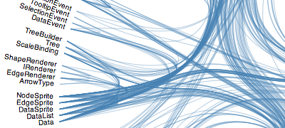

> [Wiki](Home) ▸ [[API Reference]] ▸ [[Layouts]] ▸ **Bundle Layout**

Implements Danny Holten's [hierarchical edge bundling](http://www.win.tue.nl/~dholten/papers/bundles_infovis.pdf) algorithm. For each input link, a path is computed that travels through the tree, up the parent hierarchy to the least common ancestor, and then back down to the destination node. This sequence of nodes can then be used in conjunction with other [hierarchical layouts](Hierarchy-Layout), such as [cluster](Cluster-Layout) to generate bundled splines between nodes:



For example, consider this visualization of [software dependencies](http://bl.ocks.org/mbostock/1044242).

<a name="bundle" href="Bundle-Layout#bundle">#</a> d3.layout.<b>bundle</b>()

Constructs a new default bundle layout. Currently, the bundle layout is stateless and thus only has a default configuration. The returned layout object is both an object and a function. That is: you can call the layout like any other function, and the layout has additional methods that change its behavior. Like other classes in D3, layouts follow the method chaining pattern where setter methods return the layout itself, allowing multiple setters to be invoked in a concise statement.

<a name="_bundle" href="Bundle-Layout#_bundle">#</a> <b>bundle</b>(<i>links</i>)

Evaluates the bundle layout on the specified array of *links*, returning the computed path from the source to the target, through the [least common ancestor](http://en.wikipedia.org/wiki/Lowest_common_ancestor). Each input link must have two attributes:

* source - the source node.
* target - the target node.

Furthermore, each node must have one attribute:

* parent - the parent node.

This is a subset of the fields generated by the [hierarchy layouts](Hierarchy-Layout). The return value of the layout is an array of paths, where each path is represented as an array of nodes. Thus, the bundle layout does not compute the basis splines directly; instead, it returns an array of nodes which implicitly represent the control points of the spline. You can use this array in conjunction with [d3.svg.line](SVG-Shapes#line) or [d3.svg.line.radial](SVG-Shapes#line_radial) to generate the splines themselves. For example, if you were to use a [cluster](Cluster-Layout):

```javascript
var cluster = d3.layout.cluster()
    .size([2 * Math.PI, 500]);
```

A suitable line generator for hierarchical edge bundling might be:

```javascript
var line = d3.svg.line.radial()
    .interpolate("bundle")
    .tension(.85)
    .radius(function(d) { return d.y; })
    .angle(function(d) { return d.x; });
```

The bundle layout is designed to work in conjunction with the line generator's "bundle" interpolation mode, though technically speaking you can use any interpolator or shape generator. Holten's bundle strength parameter is exposed as the line's [tension](SVG-Shapes#line_tension).