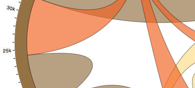

> [Wiki](Home) ▸ [[API Reference]] ▸ [[Layouts]] ▸ **Chord Layout**

**Chord diagrams** show relationships among a group of entities. For example, consider a hypothetical population of people with different hair colors: black, blonde, brown and red. Each person in this population has a preferred hair color for a dating partner; of the 29,630 (hypothetical) people with black hair, 40% (11,975) prefer partners with the same hair color. This preference is asymmetric: for example, only 10% of people with blonde hair prefer black hair, while 20% of people with black hair prefer blonde hair.

[](http://mbostock.github.com/d3/ex/chord.html)

A chord diagram visualizes these relationships by drawing quadratic Bézier curves between arcs. The source and target arcs represents two mirrored subsets of the total population, such as the number of people with black hair that prefer blonde hair, and the number of people with blonde hair that prefer black hair. As another example, consider this chord diagram of [software dependencies](http://bl.ocks.org/mbostock/1046712).

The chord layout is designed to work in conjunction with the [chord shape](SVG-Shapes#chord) and the [arc shape](SVG-Shapes#arc). The layout is used to generate data objects which describe the chords, serving as input to the chord shape. The layout also generates descriptions for the groups, which can be used as input to the arc shape.

<a name="chord" href="Chord-Layout#chord">#</a> d3.layout.<b>chord</b>()

Constructs a new chord layout. By default, the input data is not sorted, and there is no padding between groups. Unlike some of the other layouts, the chord layout is not a function to be applied to data; instead, data is specified by setting the associated [matrix](Chord-Layout#matrix), and retrieved using the [chords](Chord-Layout#chords) and [groups](Chord-Layout#groups) accessors.

<a name="matrix" href="Chord-Layout#matrix">#</a> chord.<b>matrix</b>([<i>matrix</i>])

If *matrix* is specified, sets the input data matrix used by this layout. If *matrix* is not specified, returns the current data matrix, which defaults to undefined. The input matrix must be a [square matrix](http://en.wikipedia.org/wiki/Matrix_(mathematics)#Square_matrices) of numbers, such as:

```javascript
[[11975,  5871, 8916, 2868],
 [ 1951, 10048, 2060, 6171],
 [ 8010, 16145, 8090, 8045],
 [ 1013,   990,  940, 6907]]
```

Each row in the matrix corresponds to a distinct group, such as a hair color in the above example. Each column *i* in the matrix corresponds to the same group as row *i*; the cell *ij* corresponds to the relationship from group *i* to group *j*.

<a name="padding" href="Chord-Layout#padding">#</a> chord.<b>padding</b>([<i>padding</i>])

If *padding* is specified, sets the angular padding between groups to the specified value in [radians](http://en.wikipedia.org/wiki/Radian). If *padding* is not specified, returns the current padding, which defaults to zero. You may wish to compute the padding as a function of the number of groups (the number of rows or columns in the associated matrix).

<a name="sortGroups" href="Chord-Layout#sortGroups">#</a> chord.<b>sortGroups</b>([<i>comparator</i>])

If *comparator* is specified, sets the sort order of groups (rows) for the layout using the specified comparator function. The comparator function is invoked for pairs of rows, being passed the sum of row *i* and row *j*. Typically, the comparator should be specified as either [d3.ascending](Arrays#d3_ascending) or [d3.descending](Arrays#d3_descending). If *comparator* is not specified, returns the current group sort order, which defaults to null for no sorting.

<a name="sortSubgroups" href="Chord-Layout#sortSubgroups">#</a> chord.<b>sortSubgroups</b>([<i>comparator</i>])

If *comparator* is specified, sets the sort order of subgroups (columns within rows) for the layout using the specified comparator function. The comparator function is invoked for pairs of cells, being passed the value of each cell. Typically, the comparator should be specified as either ascending or descending. If *comparator* is not specified, returns the current subgroup sort order, which defaults to null for no sorting.

<a name="sortChords" href="Chord-Layout#sortChords">#</a> chord.<b>sortChords</b>([<i>comparator</i>])

If *comparator* is specified, sets the sort order of chords (z-order) for the layout using the specified comparator function. The comparator function is invoked for pairs of chords, being passed the minimum value of the associated source and target cells. Typically, the comparator should be specified as either ascending or descending. If *comparator* is not specified, returns the current chord sort order, which defaults to null for no sorting.

<a name="chords" href="Chord-Layout#chords">#</a> chord.<b>chords</b>()

Returns the computed chord objects, given the layout's current configuration and associated matrix. If the chord objects were previously-computed, this method returns the cached value. Changing any attribute of the layout implicitly clears the previously-computed chords, if any, such that the next call to this method will recompute the layout. The returned objects have the following properties:

* source - an object describing the source.
* target - an object describing the target.

These objects, in turn, describe the underlying entity:

* index - the row index, *i*.
* subindex - the column index, *j*.
* startAngle - the start angle of the arc, in radians.
* endAngle - the end angle of the arc, in radians.
* value - the value of the associated cell *ij*, a number.

Note that these objects conveniently match the default accessors for the [chord](SVG-Shapes#chord) generator; however, you can still override the accessors to tweak the layout, or simply manipulate the returned objects.

<a name="groups" href="Chord-Layout#groups">#</a> chord.<b>groups</b>()

Returns the computed group objects, given the layout's current configuration and associated matrix. If the group objects were previously-computed, this method returns the cached value. Changing any attribute of the layout implicitly clears the previously-computed groups, if any, such that the next call to this method will recompute the layout. The returned objects have the following properties:

* index - the row index, *i*.
* startAngle - the start angle of the arc, in radians.
* endAngle - the end angle of the arc, in radians.
* value - the sum of the associated row *i*, a number.

Note that these objects conveniently match the default accessors for the [arc](SVG-Shapes#arc) generator; however, you can still override the accessors to tweak the layout, or simply manipulate the returned objects.