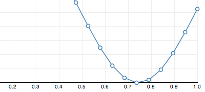
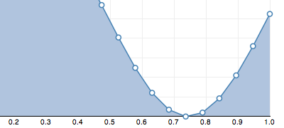
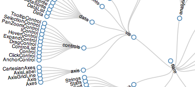

> [Wiki](Home) ▸ [[API Reference]] ▸ [[SVG]] ▸ **SVG Shapes**

SVG has a number of built-in simple shapes, such as axis-aligned rectangles and circles. For greater flexibility, you can use SVG's [[path|http://www.w3.org/TR/SVG/paths.html#PathElement]] element in conjunction with D3's path data generators. If you're familiar with Protovis, you'll note that D3's path generators are similar to Protovis marks.

A shape generator, such as that returned by [d3.svg.arc](SVG-Shapes#arc), is both an object and a function. That is: you can call the shape like any other function, and the shape has additional methods that change its behavior. Like other classes in D3, shapes follow the method chaining pattern where setter methods return the shape itself, allowing multiple setters to be invoked in a concise statement.

## SVG Elements

All SVG shapes can be transformed using the [[transform|http://www.w3.org/TR/SVG/coords.html#TransformAttribute]] attribute. You can apply the transform either to the shape directly, or to a containing [[g|http://www.w3.org/TR/SVG/struct.html#Groups]] element. Thus, when a shape is defined as "axis-aligned", that merely means axis-aligned within the local coordinate system; you can still rotate and otherwise transform the shape. Shapes can be filled and stroked using the [[fill|http://www.w3.org/TR/SVG/painting.html#FillProperties]] and [[stroke|http://www.w3.org/TR/SVG/painting.html#StrokeProperties]] styles. (You can also use the attributes of the same name, but styles are recommended as they are compatible with external stylesheets.)

<a name="svg_rect" href="SVG-Shapes#svg_rect">#</a> svg:<b>rect</b> x="0" y="0" width="0" height="0" rx="0" ry="0"

The [[rect|http://www.w3.org/TR/SVG/shapes.html#RectElement]] element defines an axis-aligned rectangle. The top-left corner of the rectangle is positioned using the *x* and *y* attributes, while its size is specified using *width* and *height*. A rounded rectangle can be produced using the optional *rx* and *ry* attributes.

<a name="svg_circle" href="SVG-Shapes#svg_circle">#</a> svg:<b>circle</b> cx="0" cy="0" r="0"

The [[circle|http://www.w3.org/TR/SVG/shapes.html#CircleElement]] element defines a circle based on a center point and a radius. The center is positioned using the *cx* and *cy* attributes, while the radius is specified using the *r* attribute.

<a name="svg_ellipse" href="SVG-Shapes#svg_ellipse">#</a> svg:<b>ellipse</b> cx="0" cy="0" rx="0" ry="0"

The [[ellipse|http://www.w3.org/TR/SVG/shapes.html#EllipseElement]] element defines an axis-aligned ellipse based on a center point and two radii. The center is positioned using the *cx* and *cy* attributes, while the radii are specified using the *rx* and *ry* attributes.

<a name="svg_line" href="SVG-Shapes#svg_line">#</a> svg:<b>line</b> x1="0" y1="0" x2="0" y2="0"

The [[line|http://www.w3.org/TR/SVG/shapes.html#LineElement]] element defines a line segment that starts at one point and ends at another. The first point is specified using the *x1* and *y1* attributes, while the second point is specified using the *x2* and *y2* attributes. The line element is a popular choice for drawing rules, reference lines, axes and tick marks.

<a name="svg_polyline" href="SVG-Shapes#svg_polyline">#</a> svg:<b>polyline</b> points=""

The [[polyline|http://www.w3.org/TR/SVG/shapes.html#PolylineElement]] element defines a set of connected straight line segments. Typically, polyline elements define open shapes. The points that make up the polyline are specified using the *points* attribute. Note: in D3, it is typically more convenient and flexible to use the [d3.svg.line](SVG-Shapes#line) path generator in conjunction with a path element.

<a name="svg_polygon" href="SVG-Shapes#svg_polygon">#</a> svg:<b>polygon</b> points=""

The [[polygon|http://www.w3.org/TR/SVG/shapes.html#PolygonElement]] element defines a closed shape consisting of a set of connected straight line segments. The points that make up the polygon are specified using the *points* attribute. Note: in D3, it is typically more convenient and flexible to use the [d3.svg.line](SVG-Shapes#line) path generator in conjunction with a path element. The line can be closed using the [[closepath|http://www.w3.org/TR/SVG/paths.html#PathDataClosePathCommand]] "Z" command.

<a name="svg_text" href="SVG-Shapes#svg_text">#</a> svg:<b>text</b> x="0" y="0" dx="0" dy="0" text-anchor="start"

The [[text|http://www.w3.org/TR/SVG/text.html#TextElement]] element defines a graphics element consisting of text. The text content of the text element (see the [[text|Selections#text]] operator) define the characters to be rendered. The anchor position of the text element is controlled using the *x* and *y* attributes; additionally, the text can be offset from the anchor using *dx* and *dy* attributes. This offset is particularly convenient for controlling the text margin and baseline, as you can use "em" units which are relative to the font size. The horizontal text alignment is controlling using the *text-anchor* attribute. Here are a few examples:

```xml
<svg:text text-anchor="start">left-align, bottom-baseline</svg:text>
<svg:text text-anchor="middle">center-align, bottom-baseline</svg:text>
<svg:text text-anchor="end">right-align, bottom-baseline</svg:text>
<svg:text dy=".35em" text-anchor="start">left-align, middle-baseline</svg:text>
<svg:text dy=".35em" text-anchor="middle">center-align, middle-baseline</svg:text>
<svg:text dy=".35em" text-anchor="end">right-align, middle-baseline</svg:text>
<svg:text dy=".71em" text-anchor="start">left-align, top-baseline</svg:text>
<svg:text dy=".71em" text-anchor="middle">center-align, top-baseline</svg:text>
<svg:text dy=".71em" text-anchor="end">right-align, top-baseline</svg:text>
```

It's possible that there is a better way to specify the text baseline using SVG's [[baseline alignment properties|http://www.w3.org/TR/SVG/text.html#BaselineAlignmentProperties]], but these don't seem to be widely supported by browsers. Lastly, the font color is typically specified using the *fill* style (you can also use *stroke*), and the font is controlled using the *font*, *font-family*, *font-size* and related styles. Some browsers also support CSS3 properties, such as *text-shadow*.

<a name="svg_path" href="SVG-Shapes#svg_path">#</a> svg:<b>path</b> d="" transform=""

The [[path|http://www.w3.org/TR/SVG/paths.html#PathElement]] element represents the outline of a shape which can be filled, stroked, used as a clipping path, or any combination of the three. The *d* attribute defines the path data, which is a [[mini-language|http://www.w3.org/TR/SVG/paths.html#PathData]] of path commands, such as *moveto* (M), *lineto* (L) and *closepath* (Z). The path element is a generalization of all other shapes in SVG, and can be used to draw nearly anything!

## Path Data Generators

To simplify the construction of the *d* attribute for path elements, D3 includes a number of helper classes for generating path data. If you're familiar with [[Protovis|http://vis.stanford.edu/protovis/]], you'll find that these path generators are similar to Protovis mark types: each generator is a function of data. So, if your data is a sequence of *xy* coordinates, you can define accessor functions that the path generators use to produce path data. For example, you might define a line generator:

```javascript
var line = d3.svg.line()
    .x(function(d) { return d.x; })
    .y(function(d) { return d.y; })
    .interpolate("basis");
```

Then later on, you can use this function to set the *d* attribute:

```javascript
g.append("path")
    .attr("d", line);
```

Whatever data is bound to `g` (in this example) will be passed to the `line` instance. Thus, the data must be specified as an array. For every element in the data array, the *x*- and *y*-accessor functions are used to pull out the control point coordinates.

A path generator, such as that returned by d3.svg.line, is both an object and a function. That is: you can call the generator like any other function, and the generator has additional methods that change its behavior. Like other classes in D3, path generators follow the method chaining pattern where setter methods return the generator itself, allowing multiple setters to be invoked in a concise statement.

<a name="line" href="SVG-Shapes#line">#</a> d3.svg.<b>line</b>()

Constructs a new line generator with the default *x*- and *y*-accessor functions (that assume the input data is a two-element array of numbers; see below for details), and linear interpolation. The returned function generates path data for an open piecewise linear curve, or polyline, as in a line chart:



By changing the interpolation, you can also generate splines and step functions. Also, don't be afraid to tack on additional path commands at the end. For example, if you want to generate a closed path, append a closepath (Z) command:

```javascript
g.append("path")
    .attr("d", function(d) { return line(d) + "Z"; });
```

The line generator is designed to work in conjunction with the [area](SVG-Shapes#area) generator. For example, when producing an area chart, you might use an area generator with a fill style, and a line generator with a stroke style to emphasize the top edge of the area. Since the line generator is only used to set the *d* attribute, you can control the appearance of the line using standard SVG styles and attributes, such as *fill*, *stroke* and *stroke-width*.

<a name="_line" href="SVG-Shapes#_line">#</a> <b>line</b>(<i>data</i>)

Returns the path data string for the specified array of *data* elements, or null if the path is empty.

<a name="line_x" href="SVG-Shapes#line_x">#</a> line.<b>x</b>([<i>x</i>])

If *x* is specified, sets the *x*-accessor to the specified function or constant. If *x* is not specified, returns the current *x*-accessor. This accessor is invoked for each element in the data array passed to the line generator. The default accessor assumes that each input element is a two-element array of numbers:

```javascript
function x(d) {
  return d[0];
}
```

Typically, an *x*-accessor is specified because the input data is in a different format, or because you want to apply a [[scale|Quantitative Scales]]. For example, if your data is specified as an object with `x` and `y` attributes, rather than a tuple, you might dereference these attributes and apply the scales simultaneously:

```javascript
var x = d3.scale.linear().range([0, w]),
    y = d3.scale.linear().range([h, 0]);

var line = d3.svg.line()
    .x(function(d) { return x(d.x); })
    .y(function(d) { return y(d.y); });
```

The *x*-accessor is invoked in the same manner as other value functions in D3. The *this* context of the function is the current element in the selection. (Technically, the same *this* context that invokes the line function; however, in the common case that the line generator is passed to the [[attr|Selections#attr]] operator, the *this* context will be the associated DOM element.) The function is passed two arguments, the current datum (d) and the current index (i). In this context, the index is the index into the array of control points, rather than the index of the current element in the selection. The *x*-accessor is invoked exactly once per datum, in the order specified by the data array. Thus, it is possible to specify a nondeterministic accessor, such as a random number generator. It is also possible to specify the *x*-accessor as a constant rather than a function, in which case all points will have the same *x*-coordinate.

<a name="line_y" href="SVG-Shapes#line_y">#</a> line.<b>y</b>([<i>y</i>])

If *y* is specified, sets the *y*-accessor to the specified function or constant. If *y* is not specified, returns the current *y*-accessor. This accessor is invoked for each element in the data array passed to the line generator. The default accessor assumes that each input element is a two-element array of numbers:

```javascript
function y(d) {
  return d[1];
}
```

For an example of how to specify a *y*-accessor, see the similar [x](SVG-Shapes#line_x) accessor. Note that, like most other graphics libraries, SVG uses the top-left corner as the origin and thus higher values of *y* are *lower* on the screen. For visualization we often want the origin in the bottom-left corner instead; one easy way to accomplish this is to invert the range of the *y*-scale by using range([h, 0]) instead of range([0, h]).

<a name="line_interpolate" href="SVG-Shapes#line_interpolate">#</a> line.<b>interpolate</b>([<i>interpolate</i>])

If *interpolate* is specified, sets the interpolation mode to the specified string or function. If *interpolate* is not specified, returns the current interpolation mode. The following named interpolation modes are supported:

* linear - piecewise linear segments, as in a polyline.
* linear-closed - close the linear segments to form a polygon.
* step - alternate between horizontal and vertical segments, as in a step function.
* step-before - alternate between vertical and horizontal segments, as in a step function.
* step-after - alternate between horizontal and vertical segments, as in a step function.
* basis - a [B-spline](http://en.wikipedia.org/wiki/B-spline), with control point duplication on the ends.
* basis-open - an open B-spline; may not intersect the start or end.
* basis-closed - a closed B-spline, as in a loop.
* bundle - equivalent to *basis*, except the *tension* parameter is used to straighten the spline.
* cardinal - a [Cardinal spline](http://en.wikipedia.org/wiki/Cubic_Hermite_spline#Cardinal_spline), with control point duplication on the ends.
* cardinal-open - an open Cardinal spline; may not intersect the start or end, but will intersect other control points.
* cardinal-closed - a closed Cardinal spline, as in a loop.
* monotone - [cubic interpolation](http://en.wikipedia.org/wiki/Monotone_cubic_interpolation) that preserves monotonicity in *y*.

The behavior of some of these interpolation modes may be further customized by specifying a [tension](SVG-Shapes#line_tension).

If *interpolate* is a function, then this function will be invoked to convert an array of points of the form [​[x0, y0], [x1, y1], …], returning an [SVG path data string](http://www.w3.org/TR/SVG/paths.html#PathData) that will be used to display the line. The "M" at the start of the string is implied and should not be returned. For example, linear interpolation is implemented as:

```js
function interpolateLinear(points) {
  return points.join("L");
}
```

This is equivalent to (and more efficient than):

```js
function interpolateLinear(points) {
  var path = "";
  for (var i = 0; i < points.length; i++) {
    if (i) path += "L";
    path += points[i][0] + "," + points[i][1];
  }
  return path;
}
```

See [bl.ocks.org/3310323](http://bl.ocks.org/mbostock/3310323) for another example of custom line interpolation.

<a name="line_tension" href="SVG-Shapes#line_tension">#</a> line.<b>tension</b>([<i>tension</i>])

If *tension* is specified, sets the Cardinal spline interpolation tension to the specified number in the range [0, 1]. If *tension* is not specified, returns the current tension. The tension only affects the Cardinal interpolation modes: cardinal, cardinal-open and cardinal-closed. The default tension is 0.7. In some sense, this can be interpreted as the length of the tangent; 1 will yield all zero tangents, and 0 yields a [Catmull-Rom spline](http://en.wikipedia.org/wiki/Cubic_Hermite_spline#Catmull.E2.80.93Rom_spline).

Note that the tension must be specified as a constant, rather than a function, as it is constant for the entirety of the line. However, it is still possible to generate multiple lines with different tensions using the same generator. For example:

```javascript
svg.selectAll("path")
    .data([0, 0.2, 0.4, 0.6, 0.8, 1])
  .enter().append("path")
    .attr("d", function(d) { return line.tension(d)(data); });
```

In this example (see the [live version](http://bl.ocks.org/mbostock/1016220)), the tension is set before each invocation of the line generator, thus resulting in lines with the same data but different paths.

<a name="line_defined" href="#line_defined">#</a> line.<b>defined</b>([<i>defined</i>])

Gets or sets the accessor function that controls where the line is defined. If *defined* is specified, sets the new accessor function and returns the line. If *defined* is not specified, returns the current accessor which defaults to `function() { return true; }`. The defined accessor can be used to define where the line is defined and undefined, which is typically useful in conjunction with missing data; the generated path data will automatically be broken into multiple distinct subpaths, skipping undefined data. For example, if you want to ignore *y*-values that are not a number (or undefined), you can say:

```js
line.defined(function(d) { return !isNaN(d[1]); });
```

<a name="line_radial" href="SVG-Shapes#line_radial">#</a> d3.svg.line.<b>radial</b>()

Constructs a new radial line generator with the default *radius*- and *angle*-accessor functions (that assume the input data is a two-element array of numbers; see below for details), and linear interpolation. The returned function generates path data for an open piecewise linear curve, or polyline, as with the Cartesian [line](SVG-Shapes#line) generator.

<a name="_line_radial" href="SVG-Shapes#_line_radial">#</a> <b>line</b>(<i>data</i>)

Returns the path data string for the specified array of *data* elements.

<a name="line_radial_radius" href="SVG-Shapes#line_radial_radius">#</a> line.<b>radius</b>([<i>radius</i>])

If *radius* is specified, sets the *radius*-accessor to the specified function or constant. If *radius* is not specified, returns the current *radius*-accessor. This accessor is invoked for each element in the data array passed to the line generator. The default accessor assumes that each input element is a two-element array of numbers:

```javascript
function radius(d) {
  return d[0];
}
```

This method is a transformation of the Cartesian [line.x](SVG-Shapes#line_x) method.

<a name="line_radial_angle" href="SVG-Shapes#line_radial_angle">#</a> line.<b>angle</b>([<i>angle</i>])

If *angle* is specified, sets the *angle*-accessor to the specified function or constant in radians. If *angle* is not specified, returns the current *angle*-accessor. This accessor is invoked for each element in the data array passed to the line generator. The default accessor assumes that each input element is a two-element array of numbers:

```javascript
function angle(d) {
  return d[1];
}
```

This method is a transformation of the Cartesian [line.y](SVG-Shapes#line_y) method.

<a name="line_radial_interpolate" href="SVG-Shapes#line_radial_interpolate">#</a> line.<b>interpolate</b>([<i>interpolate</i>])

See the Cartesian [line.interpolate](SVG-Shapes#line_interpolate) method.  The interpolation occurs after projecting to Cartesian space.

<a name="line_radial_tension" href="SVG-Shapes#line_radial_tension">#</a> line.<b>tension</b>([<i>tension</i>])

See the Cartesian [line.tension](SVG-Shapes#line_tension) method.  The interpolation occurs after projecting to Cartesian space.

<a name="line_radial_defined" href="SVG-Shapes#line_radial_defined">#</a> line.<b>defined</b>([<i>defined</i>])

See the Cartesian [line.defined](SVG-Shapes#line_defined) method.

<a name="area" href="SVG-Shapes#area">#</a> d3.svg.<b>area</b>()

Constructs a new area generator with the default *x*-, *y0*- and *y1*-accessor functions (that assume the input data is a two-element array of numbers; see below for details), and linear interpolation. The returned function generates path data for a closed piecewise linear curve, or polygon, as in an area chart:



Conceptually, the polygon is formed using two [lines](SVG-Shapes#line): the top line is formed using the *x*- and *y1*-accessor functions, and proceeds from left-to-right; the bottom line is added to this line, using the *x*- and *y0*-accessor functions, and proceeds from right-to-left. By setting the [transform](http://www.w3.org/TR/SVG/coords.html#TransformAttribute) attribute to rotate the path element by 90 degrees, you can also generate vertical areas. By changing the interpolation, you can also generate splines and step functions.

The area generator is designed to work in conjunction with the [line](SVG-Shapes#line) generator. For example, when producing an area chart, you might use an area generator with a fill style, and a line generator with a stroke style to emphasize the top edge of the area. Since the area generator is only used to set the *d* attribute, you can control the appearance of the area using standard SVG styles and attributes, such as *fill*.

To create [streamgraphs](http://mbostock.github.com/d3/ex/stream.html) (stacked area charts), use the [stack](Stack-Layout) layout. This layout sets the y0 attribute for each value in a series, which can be used from the *y0*- and *y1*-accessors. Note that each series must have the same number of values per series, and each value must have the same *x*-coordinate; if you have missing data or inconsistent *x*-coordinates per series, you must resample and interpolate your data before computing the stacked layout.

<a name="_area" href="SVG-Shapes#_area">#</a> <b>area</b>(<i>data</i>)

Returns the path data string for the specified array of *data* elements, or null if the path is empty.

<a name="area_x" href="SVG-Shapes#area_x">#</a> area.<b>x</b>([<i>x</i>])

If *x* is specified, sets the *x*-accessor to the specified function or constant. If *x* is not specified, returns the current *x*-accessor. This accessor is invoked for each element in the data array passed to the area generator. The default accessor assumes that each input element is a two-element array of numbers:

```javascript
function x(d) {
  return d[0];
}
```

Typically, an *x*-accessor is specified because the input data is in a different format, or because you want to apply a [[scale|Quantitative Scales]]. For example, if your data is specified as an object with `x` and `y` attributes, rather than a tuple, you might dereference these attributes and apply the scales simultaneously:

```javascript
var x = d3.scale.linear().range([0, w]),
    y = d3.scale.linear().range([h, 0]);

var area = d3.svg.area()
    .x(function(d) { return x(d.x); })
    .y0(h)
    .y1(function(d) { return y(d.y); });
```

The *x*-accessor is invoked in the same manner as other value functions in D3. The *this* context of the function is the current element in the selection. (Technically, the same *this* context that invokes the area function; however, in the common case that the area generator is passed to the [[attr|Selections#attr]] operator, the *this* context will be the associated DOM element.) The function is passed two arguments, the current datum (d) and the current index (i). In this context, the index is the index into the array of control points, rather than the index of the current element in the selection. The *x*-accessor is invoked exactly once per datum, in the order specified by the data array. Thus, it is possible to specify a non-deterministic accessor, such as a random number generator. It is also possible to specify the *x*-accessor as a constant rather than a function, in which case all points will have the same *x*-coordinate.

<a name="area_x0" href="SVG-Shapes#area_x0">#</a> area.<b>x0</b>([<i>x0</i>])

…

<a name="area_x1" href="SVG-Shapes#area_x1">#</a> area.<b>x1</b>([<i>x1</i>])

…

<a name="area_y" href="SVG-Shapes#area_y">#</a> area.<b>y</b>([<i>y</i>])

…

<a name="area_y0" href="SVG-Shapes#area_y0">#</a> area.<b>y0</b>([<i>y0</i>])

If *y0* is specified, sets the *y0*-accessor to the specified function or constant. If *y0* is not specified, returns the current *y0*-accessor. This accessor is invoked for each element in the data array passed to the area generator. The default accessor is the constant zero, thus using a fixed baseline at *y* = 0. For an example of how to specify a *y0*-accessor, see the similar [x](SVG-Shapes#area_x) accessor.

<a name="area_y1" href="SVG-Shapes#area_y1">#</a> area.<b>y1</b>([<i>y1</i>])

If *y1* is specified, sets the *y1*-accessor to the specified function or constant. If *y1* is not specified, returns the current *y1*-accessor. This accessor is invoked for each element in the data array passed to the area generator. The default accessor assumes that each input element is a two-element array of numbers:

```javascript
function y1(d) {
  return d[1];
}
```

For an example of how to specify a *y1*-accessor, see the similar [x](SVG-Shapes#area_x) accessor. Note that, like most other graphics libraries, SVG uses the top-left corner as the origin and thus higher values of *y* are *lower* on the screen. For visualization we often want the origin in the bottom-left corner instead; one easy way to accomplish this is to invert the range of the *y*-scale by using range([h, 0]) instead of range([0, h]).

<a name="area_interpolate" href="SVG-Shapes#area_interpolate">#</a> area.<b>interpolate</b>([<i>interpolate</i>])

If *interpolate* is specified, sets the interpolation mode to the specified string or function. If *interpolate* is not specified, returns the current interpolation mode. The following named modes are supported:

* linear - piecewise linear segments, as in a polyline.
* step - alternate between horizontal and vertical segments, as in a step function.
* step-before - alternate between vertical and horizontal segments, as in a step function.
* step-after - alternate between horizontal and vertical segments, as in a step function.
* basis - a [B-spline](http://en.wikipedia.org/wiki/B-spline), with control point duplication on the ends.
* basis-open - an open B-spline; may not intersect the start or end.
* cardinal - a [Cardinal spline](http://en.wikipedia.org/wiki/Cubic_Hermite_spline#Cardinal_spline), with control point duplication on the ends.
* cardinal-open - an open Cardinal spline; may not intersect the start or end, but will intersect other control points.
* monotone - [cubic interpolation](http://en.wikipedia.org/wiki/Monotone_cubic_interpolation) that preserves monotonicity in *y*.

The behavior of some of these interpolation modes may be further customized by specifying a [tension](SVG-Shapes#area_tension). Technically, the basis-closed and cardinal-closed interpolation modes are also supported, but these make more sense in the context of a line rather than an area.

If *interpolate* is a function, then this function will be invoked to convert an array of points of the form [​[x0, y0], [x1, y1], …], returning an [SVG path data string](http://www.w3.org/TR/SVG/paths.html#PathData) that will be used to display the area. The "M" at the start of the string is implied and should not be returned. For example, linear interpolation is implemented as:

```js
function interpolateLinear(points) {
  return points.join("L");
}
```

This is equivalent to (and more efficient than):

```js
function interpolateLinear(points) {
  var path = "";
  for (var i = 0; i < points.length; i++) {
    if (i) path += "L";
    path += points[i][0] + "," + points[i][1];
  }
  return path;
}
```

See [bl.ocks.org/3310323](http://bl.ocks.org/mbostock/3310323) for another example of custom interpolation.

<a name="area_tension" href="SVG-Shapes#area_tension">#</a> area.<b>tension</b>([<i>tension</i>])

If *tension* is specified, sets the Cardinal spline interpolation tension to the specified number in the range [0, 1]. If *tension* is not specified, returns the current tension. The tension only affects the Cardinal interpolation modes: cardinal, cardinal-open and cardinal-closed. The default tension is 0.7. In some sense, this can be interpreted as the length of the tangent; 1 will yield all zero tangents, and 0 yields a [Catmull-Rom spline](http://en.wikipedia.org/wiki/Cubic_Hermite_spline#Catmull.E2.80.93Rom_spline). Note that the tension must be specified as a constant, rather than a function, as it is constant for the entirety of the area.

<a name="area_defined" href="#area_defined">#</a> area.<b>defined</b>([<i>defined</i>])

Gets or sets the accessor function that controls where the area is defined. If *defined* is specified, sets the new accessor function and returns the area. If *defined* is not specified, returns the current accessor which defaults to `function() { return true; }`. The defined accessor can be used to define where the area is defined and undefined, which is typically useful in conjunction with missing data; the generated path data will automatically be broken into multiple distinct subpaths, skipping undefined data. For example, if you want to ignore *y*-values that are not a number (or undefined), you can say:

```js
area.defined(function(d) { return !isNaN(d[1]); });
```

<a name="area_radial" href="SVG-Shapes#area_radial">#</a> d3.svg.area.<b>radial</b>()

…

<a name="_area_radial" href="SVG-Shapes#_area_radial">#</a> <b>area</b>(<i>data</i>)

Returns the path data string for the specified array of *data* elements.

<a name="area_radial_radius" href="SVG-Shapes#area_radial_radius">#</a> area.<b>radius</b>([<i>radius</i>])

…

<a name="area_radial_innerRadius" href="SVG-Shapes#area_radial_innerRadius">#</a> area.<b>innerRadius</b>([<i>radius</i>])

…

<a name="area_radial_outerRadius" href="SVG-Shapes#area_radial_innerRadius">#</a> area.<b>innerRadius</b>([<i>radius</i>])

…

<a name="area_radial_angle" href="SVG-Shapes#area_radial_angle">#</a> area.<b>angle</b>([<i>angle</i>])

…

<a name="area_radial_startAngle" href="SVG-Shapes#area_radial_startAngle">#</a> area.<b>startAngle</b>([<i>angle</i>])

…

<a name="area_radial_endAngle" href="SVG-Shapes#area_radial_endAngle">#</a> area.<b>endAngle</b>([<i>angle</i>])

…

<a name="arc" href="SVG-Shapes#arc">#</a> d3.svg.<b>arc</b>()

Constructs a new arc generator with the default inner radius, outer radius, start angle and end angle accessor functions (that assume the input data is an object with named attributes matching the accessors; see below for details). While the default accessors assume that the arc dimensions are all specified dynamically, it is very common to set one or more of the dimensions as a constant, such as setting the inner radius to zero for a pie chart. The returned function generates path data for a closed solid arc, as in a pie or donut chart:


In fact, four forms are possible: a [circle](http://en.wikipedia.org/wiki/Circle) (when the inner radius is zero and the angular span is greater than or equal to 2π), a [circular sector](http://en.wikipedia.org/wiki/Circular_sector) (when the inner radius is zero and the angular span is less than 2π), an [annulus](http://en.wikipedia.org/wiki/Annulus_(mathematics)) (when the inner radius is non-zero and the angular span is greater than or equal to 2π), and an annular sector (when the inner radius is non-zero and the angular span is less than 2π).

<a name="_arc" href="SVG-Shapes#_arc">#</a> <b>arc</b>(<i>datum</i>[, <i>index</i>])

Returns the path data string for the specified *datum*. An optional *index* may be specified, which is passed through to the arc's accessor functions.

<a name="arc_innerRadius" href="SVG-Shapes#arc_innerRadius">#</a> arc.<b>innerRadius</b>([<i>radius</i>])

If *radius* is specified, sets the inner radius accessor to the specified function or constant. If *radius* is not specified, returns the current inner radius accessor, which defaults to:

```javascript
function innerRadius(d) {
  return d.innerRadius;
}
```

The arc generator arguments (typically `d` and `i`) and context (`this`) are passed through to the accessor function. An inner radius accessor function is useful for handling data in a different format or for applying a [quantitative scale](Quantitative Scales) to encode data. A constant inner radius may be used to create a standard pie or donut chart.

<a name="arc_outerRadius" href="SVG-Shapes#arc_outerRadius">#</a> arc.<b>outerRadius</b>([<i>radius</i>])

If *radius* is specified, sets the outer radius accessor to the specified function or constant. If *radius* is not specified, returns the current outer radius accessor, which defaults to:

```javascript
function outerRadius(d) {
  return d.outerRadius;
}
```

The arc generator arguments (typically `d` and `i`) and context (`this`) are passed through to the accessor function. An outer radius accessor function is useful for handling data in a different format or for applying a [quantitative scale](Quantitative Scales) to encode data. A constant outer radius may be used to create a standard pie or donut chart.

<a name="arc_cornerRadius" href="#arc_cornerRadius">#</a> arc.<b>cornerRadius</b>([<i>radius</i>])

If *radius* is specified, sets the corner radius accessor to the specified function or constant. If *radius* is not specified, returns the current outer radius accessor, which defaults to zero. Although a constant corner radius is typically used, the corner radius may also be specified as a function. The arc generator arguments (typically `d` and `i`) and context (`this`) are passed through to the accessor function.

<a name="arc_padRadius" href="#arc_padRadius">#</a> arc.<b>padRadius</b>([<i>radius</i>])

If *radius* is specified, sets the pad radius accessor to the specified function or constant. If *radius* is not specified, returns the current pad radius accessor, which defaults to “auto”. The “auto” pad radius method computes the pad radius based on the previously-computed [inner](#arc_innerRadius) and [outer](#arc_outerRadius) as:

```javascript
function padRadius(innerRadius, outerRadius) {
  return Math.sqrt(innerRadius * innerRadius + outerRadius * outerRadius);
}
```

This implementation is designed to preserve the approximate relative area of arcs in conjunction with [pie.padAngle](Pie-Layout#padAngle).

The pad radius is the radius at which the [pad angle](#arc_padAngle) is applied: the nominal padding distance between parallel edges of adjacent arcs is defined as padRadius * padAngle. (The padding distance may be smaller if the inner radius is small relative to the pad angle.) The pad radius typically does not need to be changed from “auto”, but can be useful to ensure parallel edges between arcs with differing inner or outer radii, as when [extending an arc on hover](http://bl.ocks.org/mbostock/32bd93b1cc0fbccc9bf9).

If the pad radius is specified as an accessor function, the arc generator arguments (typically `d` and `i`) and context (`this`) are passed through to the accessor function.

<a name="arc_startAngle" href="SVG-Shapes#arc_startAngle">#</a> arc.<b>startAngle</b>([<i>angle</i>])

If *angle* is specified, sets the start angle accessor to the specified function or constant. If *angle* is not specified, returns the current start angle accessor, which defaults to:

```javascript
function startAngle(d) {
  return d.startAngle;
}
```

Angles are specified in radians; 0 corresponds to 12 o’clock (negative *y*) and proceeds clockwise, repeating at 2π. If the start angle is specified as an accessor function, the arc generator arguments (typically `d` and `i`) and context (`this`) are passed through to the accessor function.

For constructing pie or donut charts, you will need to compute the start angle of each arc as the end angle of the previous arc. This can be done conveniently using the [pie layout](Pie-Layout), which takes an array of input data and returns arc objects with `startAngle` and `endAngle` attributes compatible with the default arc accessors.

<a name="arc_endAngle" href="SVG-Shapes#arc_endAngle">#</a> arc.<b>endAngle</b>([<i>angle</i>])

If *angle* is specified, sets the end angle accessor to the specified function or constant. If *angle* is not specified, returns the current end angle accessor, which defaults to:

```javascript
function endAngle(d) {
  return d.endAngle;
}
```

Angles are specified in radians; 0 corresponds to 12 o’clock (negative *y*) and proceeds clockwise, repeating at 2π. If the end angle is specified as an accessor function, the arc generator arguments (typically `d` and `i`) and context (`this`) are passed through to the accessor function.

For constructing pie or donut charts, you will need to compute the end angle of each arc as appropriate. This can be done conveniently using the [pie layout](Pie-Layout), which takes an array of input data and returns arc objects with `startAngle` and `endAngle` attributes compatible with the default arc accessors.

<a name="arc_padAngle" href="#arc_padAngle">#</a> arc.<b>padAngle</b>([<i>angle</i>])

If *angle* is specified, sets the pad angle accessor to the specified function or constant. If *angle* is not specified, returns the current pad angle accessor, which defaults to:

```javascript
function padAngle(d) {
  return d.padAngle;
}
```

Angles are specified in radians. If the pad angle is specified as an accessor function, the arc generator arguments (typically `d` and `i`) and context (`this`) are passed through to the accessor function.

Although the pad angle can be specified as a constant, it is preferable to use the default pad angle accessor and instead use [pie.padAngle](Pie-Layout#padAngle) to compute the appropriate pad angle, and to recompute the start and end angles of each arc so as to preserve approximate relative areas.

<a name="arc_centroid" href="SVG-Shapes#arc_centroid">#</a> arc.<b>centroid</b>(<i>arguments…</i>)

Computes the centroid of the arc that would be generated from the specified input *arguments*; typically, the arguments are the current datum (d), and optionally the current index (i). The centroid is defined as the midpoint in polar coordinates of the inner and outer radius, and the start and end angle. This provides a convenient location for arc labels. For example:

```javascript
arcs.append("text")
    .attr("transform", function(d) { return "translate(" + arc.centroid(d) + ")"; })
    .attr("dy", ".35em")
    .attr("text-anchor", "middle")
    .text(function(d) { return d.value; });
```

Alternatively, you can use SVG's transform attribute to rotate text into position, though you may need to convert radians back into degrees. Yet another possibility is to use a [textPath](http://www.w3.org/TR/SVG/text.html#TextPathElement) element to curve the label along the path of the arc!

<a name="symbol" href="SVG-Shapes#symbol">#</a> d3.svg.<b>symbol</b>()

Constructs a new symbol generator with the default *type*- and *size*-accessor functions (that make no assumptions about input data, and produce a circle sized 64 square pixels; see below for details). While the default accessors generate static symbols, it is common to set one or more of the accessors using a function, such as setting the size proportional to a dimension of data for a scatterplot. The returned function generates path data for various symbols, as in a dot plot:


Note that the symbol does not include accessors for *x* and *y*. Instead, you can use the path element's [transform](http://www.w3.org/TR/SVG/coords.html#TransformAttribute) attribute to position the symbols, as in:

```javascript
vis.selectAll("path")
    .data(data)
  .enter().append("path")
    .attr("transform", function(d) { return "translate(" + x(d.x) + "," + y(d.y) + ")"; })
    .attr("d", d3.svg.symbol());
```

In the future, we may add *x*- and *y*-accessors for parity with the line and area generators. The symbol will be centered at the origin (0,0) of the local coordinate system. You can also use SVG's built-in basic shapes to produce many of these symbol types, though D3's symbol generator is useful in conjunction with path elements because you can easily change the symbol type and size as a function of data.

<a name="_symbol" href="SVG-Shapes#_symbol">#</a> <b>symbol</b>(<i>datum</i>[, <i>index</i>])

Returns the path data string for the specified *datum*. An optional *index* may be specified, which is passed through to the symbol's accessor functions.

<a name="symbol_type" href="SVG-Shapes#symbol_type">#</a> symbol.<b>type</b>([<i>type</i>])

If *type* is specified, sets the *type*-accessor to the specified function or constant. If *type* is not specified, returns the current *type*-accessor. The default accessor is the constant "circle", and the following types are supported:

* circle - a [circle](http://en.wikipedia.org/wiki/Circle).
* cross - a [Greek cross](http://en.wikipedia.org/wiki/Cross) or plus sign.
* diamond - a [rhombus](http://en.wikipedia.org/wiki/Rhombus).
* square - an axis-aligned [square](http://en.wikipedia.org/wiki/Square_(geometry)).
* triangle-down - a downward-pointing [equilateral triangle](http://en.wikipedia.org/wiki/Equilateral_triangle).
* triangle-up - an upward-pointing equilateral triangle.

Types are normalized to have the same area in square pixels, according to the specified [size](SVG-Shapes#symbol_size). However, note that different types' sizes may be affected by the stroke and stroke width in different ways. All of the types are designed to be visible when only a fill style is used (unlike the Protovis cross), although they generally look better when both a fill and stroke is used.

The *type*-accessor is invoked in the same manner as other value functions in D3. The *this* context of the function is the current element in the selection. (Technically, the same *this* context that invokes the arc function; however, in the common case that the symbol generator is passed to the [[attr|Selections#attr]] operator, the *this* context will be the associated DOM element.) The function is passed two arguments, the current datum (d) and the current index (i). It is also possible to specify the *type*-accessor as a constant rather than a function.

<a name="symbol_size" href="SVG-Shapes#symbol_size">#</a> symbol.<b>size</b>([<i>size</i>])

If *size* is specified, sets the *size*-accessor to the specified function or constant in square pixels. If *size* is not specified, returns the current *size*-accessor.  The default is 64. This accessor is invoked on the argument passed to the symbol generator. Typically, a *size*-accessor is specified as a function when you want the size of the symbol to encode a [quantitative dimension](Quantitative-Scales) of data, or a constant it you simply want to make all the dots bigger or smaller. If you want to specify a radius rather than the size, you must do so indirectly, for example using a [pow](Quantitative-Scales#pow) scale with exponent 2.

<a name="symbolTypes" href="SVG-Shapes#symbolTypes">#</a> d3.svg.<b>symbolTypes</b>

The array of supported [symbol types](#symbol_type).

<a name="chord" href="SVG-Shapes#chord">#</a> d3.svg.<b>chord</b>()

Constructs a new chord generator with the default accessor functions (that assume the input data is an object with named attributes matching the accessors; see below for details). While the default accessors assume that the chord dimensions are all specified dynamically, it is very common to set one or more of the dimensions as a constant, such as the radius. The returned function generates path data for a closed shape connecting two [arcs](http://en.wikipedia.org/wiki/Arc_(geometry)) with quadratic Bézier curves, as in a [chord diagram](http://mbostock.github.com/d3/ex/chord.html):


A chord generator is often used in conjunction with an [arc generator](SVG-Shapes#arc), so as to draw annular segments at the start and end of the chords. In addition, the [chord layout](Chord-Layout) is useful for generating objects that describe a set of grouped chords from a matrix, compatible with the default accessors.

<a name="_chord" href="SVG-Shapes#_chord">#</a> <b>chord</b>(<i>datum</i>[, <i>index</i>])

Returns the path data string for the specified *datum*. An optional *index* may be specified, which is passed through to the chord's accessor functions.

<a name="chord_source" href="SVG-Shapes#chord_source">#</a> chord.<b>source</b>([<i>source</i>])

If *source* is specified, sets the *source*-accessor to the specified function or constant. If *source* is not specified, returns the current *source*-accessor. The purpose of the *source* accessor is to return an object that describes the starting arc of the chord. The returned object is subsequently passed to the [radius](SVG-Shapes#chord_radius), [startAngle](SVG-Shapes#chord_startAngle) and [endAngle](SVG-Shapes#chord_endAngle) accessors. This allows these other accessors to be reused for both the source and target arc descriptions. The default accessor assumes that the input data is an object with suitably-named attributes:

```javascript
function source(d) {
  return d.source;
}
```

The *source*-accessor is invoked in the same manner as other value functions in D3. The *this* context of the function is the current element in the selection. (Technically, the same *this* context that invokes the arc function; however, in the common case that the symbol generator is passed to the [[attr|Selections#attr]] operator, the *this* context will be the associated DOM element.) The function is passed two arguments, the current datum (d) and the current index (i). It is also possible to specify the *source*-accessor as a constant rather than a function.

<a name="chord_target" href="SVG-Shapes#chord_target">#</a> chord.<b>target</b>([<i>target</i>])

If *target* is specified, sets the *target*-accessor to the specified function or constant. If *target* is not specified, returns the current *target*-accessor. The purpose of the *target* accessor is to return an object that describes the ending arc of the chord. The returned object is subsequently passed to the [radius](SVG-Shapes#chord_radius), [startAngle](SVG-Shapes#chord_startAngle) and [endAngle](SVG-Shapes#chord_endAngle) accessors. This allows these other accessors to be reused for both the source and target arc descriptions. The default accessor assumes that the input data is an object with suitably-named attributes:

```javascript
function target(d) {
  return d.target;
}
```

The *target*-accessor is invoked in the same manner as other value functions in D3. The function is passed two arguments, the current datum (d) and the current index (i). It is also possible to specify the *target*-accessor as a constant rather than a function.

<a name="chord_radius" href="SVG-Shapes#chord_radius">#</a> chord.<b>radius</b>([<i>radius</i>])

If *radius* is specified, sets the *radius*-accessor to the specified function or constant. If *radius* is not specified, returns the current *radius*-accessor. The default accessor assumes that the input source or target description is an object with suitably-named attributes:

```javascript
function radius(d) {
  return d.radius;
}
```

The *radius*-accessor is invoked in a similar manner as other value functions in D3. The function is passed two arguments, the current source description (derived from the current datum, d) and the current index (i). It is also possible to specify the *radius*-accessor as a constant rather than a function.

<a name="chord_startAngle" href="SVG-Shapes#chord_startAngle">#</a> chord.<b>startAngle</b>([<i>angle</i>])

If *startAngle* is specified, sets the *startAngle*-accessor to the specified function or constant. If *startAngle* is not specified, returns the current *startAngle*-accessor. Angles are specified in radians; 0 corresponds to 12 o’clock (negative *y*) and proceeds clockwise, repeating at 2π. The default accessor assumes that the input source or target description is an object with suitably-named attributes:

```javascript
function startAngle(d) {
  return d.startAngle;
}
```

The *startAngle*-accessor is invoked in a similar manner as other value functions in D3. The function is passed two arguments, the current source or target description (derived from the current datum, d) and the current index (i). It is also possible to specify the *startAngle*-accessor as a constant rather than a function.

<a name="chord_endAngle" href="SVG-Shapes#chord_endAngle">#</a> chord.<b>endAngle</b>([<i>angle</i>])

If *endAngle* is specified, sets the *endAngle*-accessor to the specified function or constant. If *endAngle* is not specified, returns the current *endAngle*-accessor. Angles are specified in radians; 0 corresponds to 12 o’clock (negative *y*) and proceeds clockwise, repeating at 2π. The default accessor assumes that the input source or target description is an object with suitably-named attributes:

```javascript
function endAngle(d) {
  return d.endAngle;
}
```

The *endAngle*-accessor is invoked in a similar manner as other value functions in D3. The function is passed two arguments, the current source or target description (derived from the current datum, d) and the current index (i). It is also possible to specify the *endAngle*-accessor as a constant rather than a function.

<a name="diagonal" href="SVG-Shapes#diagonal">#</a> d3.svg.<b>diagonal</b>()

Constructs a new diagonal generator with the default accessor functions (that assume the input data is an object with named attributes matching the accessors; see below for details). The returned function generates the path data for a cubic Bézier connecting the source and target points; the tangents are specified to produce smooth fan-in and fan-out when connecting nodes, as in a [node-link diagram](http://mbostock.github.com/d3/ex/tree.html):



Although diagonals default to Cartesian (axis-aligned) orientations, they can be used in radial and other orientations using a [projection](SVG-Shapes#diagonal_projection).

<a name="_diagonal" href="SVG-Shapes#_diagonal">#</a> <b>diagonal</b>(<i>datum</i>[, <i>index</i>])

Returns the path data string for the specified *datum*. An optional *index* may be specified, which is passed through to the diagonal's accessor functions.

<a name="diagonal_source" href="SVG-Shapes#diagonal_source">#</a> diagonal.<b>source</b>([<i>source</i>])

If *source* is specified, sets the *source*-accessor to the specified function or constant. If *source* is not specified, returns the current *source*-accessor. The purpose of the *source* accessor is to return an object of the form `{x, y}` that describes the starting point of the diagonal. (The returned object is subsequently passed to the [projection](SVG-Shapes#diagonal_projection).) The default accessor assumes that the input data is an object with suitably-named attributes:

```javascript
function source(d) {
  return d.source;
}
```

The *source*-accessor is invoked in the same manner as other value functions in D3. The *this* context of the function is the current element in the selection. (Technically, the same *this* context that invokes the diagonal function; however, in the common case that the symbol generator is passed to the [[attr|Selections#attr]] operator, the *this* context will be the associated DOM element.) The function is passed two arguments, the current datum (d) and the current index (i). It is also possible to specify the *source*-accessor as a constant rather than a function.

<a name="diagonal_target" href="SVG-Shapes#diagonal_target">#</a> diagonal.<b>target</b>([<i>target</i>])

If *target* is specified, sets the *target*-accessor to the specified function or constant. If *target* is not specified, returns the current *target*-accessor. The purpose of the *target* accessor is to return an object of the form `{x, y}` that describes the ending point of the diagonal. (The returned object is subsequently passed to the [projection](SVG-Shapes#diagonal_projection).) The default accessor assumes that the input data is an object with suitably-named attributes:

```javascript
function target(d) {
  return d.target;
}
```

The *target*-accessor is invoked in the same manner as other value functions in D3. The function is passed two arguments, the current datum (d) and the current index (i). It is also possible to specify the *source*-accessor as a constant rather than a function.

<a name="diagonal_projection" href="SVG-Shapes#diagonal_projection">#</a> diagonal.<b>projection</b>([<i>projection</i>])

If *projection* is specified, sets the *projection* to the specified function. If *projection* is not specified, returns the current *projection*. The *projection* converts a point (such as that returned by the source and target accessors) of the form `{x, y}` to a two-element array of numbers. The default accessor assumes that the input point is an object with *x* and *y* attributes:

```javascript
function projection(d) {
  return [d.x, d.y];
}
```

The default accessor is thus compatible with D3's various node layouts, including [tree](Tree-Layout), [partition](Partition-Layout) and [cluster](Cluster-Layout). For example, to produce a radial diagonal, assuming that the *y* attribute defines the radius in pixels, and the *x* attribute defines the angle in degrees:

```javascript
function projection(d) {
  var r = d.y, a = (d.x - 90) / 180 * Math.PI;
  return [r * Math.cos(a), r * Math.sin(a)];
}
```

The *projection* is invoked in a similar manner as other value functions in D3. The function is passed two arguments, the current source or target point (derived from the current data, d) and the current index (i).

<a name="diagonal_radial" href="SVG-Shapes#diagonal_radial">#</a> d3.svg.diagonal.<b>radial</b>()

…

<a name="_diagonal_radial" href="SVG-Shapes#_diagonal_radial">#</a> <b>diagonal</b>(<i>datum</i>[, <i>index</i>])

Returns the path data string for the specified *datum*. An optional *index* may be specified, which is passed through to the diagonal's accessor functions.