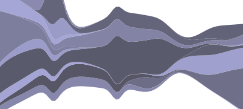

> [Wiki](Home) ▸ [[API Reference]] ▸ [[Layouts]] ▸ **Stack Layout**

The stack layout takes a two-dimensional array of data and computes a baseline; the baseline is then propagated to the above layers, so as to produce a stacked graph. Several baseline algorithms are supported, along with sorting heuristics to improve perception, as described in [“Stacked Graphs—Geometry & Aesthetics”](http://www.leebyron.com/else/streamgraph/download.php?file=stackedgraphs_byron_wattenberg.pdf) by Byron & Wattenberg.

[](http://bl.ocks.org/mbostock/4060954)

The stack layout operates in an arbitrary two-dimensional *x* and *y* coordinate space, similar to D3's other layouts, including [tree](Tree-Layout). Thus, layers can be stacked vertically, horizontally, or even [radially](http://hint.fm/projects/flickr/). While the "zero" offset is the default, a streamgraph can be generated using the "wiggle" offset, which attempts to minimize change in slope weighted by layer thickness.

<a name="stack" href="Stack-Layout#stack">#</a> d3.layout.<b>stack</b>()

Constructs a new stack layout with the default offset (zero) and order (null). The returned layout object is both an object and a function. That is: you can call the layout like any other function, and the layout has additional methods that change its behavior. Like other classes in D3, layouts follow the method chaining pattern where setter methods return the layout itself, allowing multiple setters to be invoked in a concise statement.

<a name="_stack" href="Stack-Layout#_stack">#</a> <b>stack</b>(<i>layers</i>[, <i>index</i>])

Computes the *y*-coordinate baseline for each series (layer) in *layers*, and then propagate that baseline to the other layers. In the simplest case, *layers* is a two-dimensional array of values. All of the 2nd-dimensional arrays must be the same length. The [y](Stack-Layout#y) and [x](Stack-Layout#x) accessors are used to define the *y*-thickness of each layer at the given *x*-position, respectively. Thus, by default the following attributes are required on each value:

* x - the *x*-position of the value.
* y - the *y*-thickness of the value.
* y0 - the minimum *y*-position of the value (baseline).

These attributes can be customized by overriding the accessors and the [out](Stack-Layout#out) function.

<a name="values" href="Stack-Layout#values">#</a> stack.<b>values</b>([<i>accessor</i>])

Specifies how to extract values from the associated element in *layers*; *accessor* is a function which is invoked on each input layer passed to [stack](Stack-Layout#_stack), equivalent to calling *layers.map(accessor)* before computing the stack layout. The default values function is the built-in [Object](https://developer.mozilla.org/en/JavaScript/Reference/Global_Objects/Object), which is similar to the identity function. If *accessor* is not specified, returns the current values accessor.

The values accessor can be used to associate additional data per-layer, rather than per-point. For example, say your data were structured as follows:

```js
var layers = [
  {
    "name": "apples",
    "values": [
      { "x": 0, "y":  91},
      { "x": 1, "y": 290}
    ]
  },
  {  
    "name": "oranges",
    "values": [
      { "x": 0, "y":  9},
      { "x": 1, "y": 49}
    ]
  }
];
```

Specify a values accessor that retrieves the points for each layer:

```js
var stack = d3.layout.stack()
    .offset("wiggle")
    .values(function(d) { return d.values; });
```

Then, if you wanted to add a tooltip for each layer, you might say:

```js
svg.selectAll("path")
    .data(stack(layers))
  .enter().append("path")
    .attr("d", function(d) { return area(d.values); })
  .append("title")
    .text(function(d) { return d.name; });
```

<a name="offset" href="Stack-Layout#offset">#</a> stack.<b>offset</b>([<i>offset</i>])

If *offset* is specified, sets the stack offset algorithm to the specified value. If *offset* is not specified, returns the current offset algorithm. The following string values are supported:

* silhouette - center the stream, as in [ThemeRiver](http://citeseerx.ist.psu.edu/viewdoc/download?doi=10.1.1.39.2977&rep=rep1&type=pdf).
* wiggle - minimize weighted change in slope.
* expand - normalize layers to fill the range [0,1].
* zero - use a zero baseline, *i.e.*, the *y*-axis.

In addition to a string, *offset* may be specified as a function. The input to the offset function is the layer data, converted to a standardized representation: a two-dimensional array of values, where each value is represented as a two-element array [*x*, *y*]. The return value of the offset function must be an array of values which represents the *y*-coordinates of the baseline. For example, the default "zero" offset is implemented as:

```javascript
function offset(data) {
  var j = -1,
      m = data[0].length,
      y0 = [];
  while (++j < m) y0[j] = 0;
  return y0;
}
```

<a name="order" href="Stack-Layout#order">#</a> stack.<b>order</b>([<i>order</i>])

If *order* is specified, sets the stack order to the specified value. If *order* is not specified, returns the current order. The following string values are supported:

* inside-out - sort by index of maximum value, then use balanced weighting.
* reverse - reverse the input layer order.
* default - use the input layer order.

In addition to a string, *order* may be specified as a function. The input to the order function is the layer data, converted to the standardized representation: a two-dimensional array of values, where each value is represented as a two-element array [*x*, *y*]. The return value of the order function must be an array of indexes which represents the layer order. For example, the default order is implemented as:

```javascript
function order(data) {
  return d3.range(data.length);
}
```

See also [d3.range](Arrays#d3_range).

<a name="x" href="Stack-Layout#x">#</a> stack.<b>x</b>([<i>accessor</i>])

Specifies how to access the *x*-coordinate of each value's position. If *accessor* is specified, sets the accessor to the specified function. If *accessor* is not specified, returns the current function, which by default assumes that each input value has an x attribute:

```javascript
function x(d) {
  return d.x;
}
```

The *x*-accessor is invoked for each input value, for each input layer, being passed the current data (d) and index (i). The return value of the accessor must be a number. Although the *x*-accessor is invoked for all layers (not just the bottommost layer), the stack layout assumes that the *x*-coordinates of all layers are consistent. In other words, the stack layout currently requires that the layers be homogenous: each must contain the same number of values at the same *x*-coordinates. If your data is not so regular, you will need to reinterpolate the data before computing the stack.

<a name="y" href="Stack-Layout#y">#</a> stack.<b>y</b>([<i>accessor</i>])

Specifies how to access the *y*-coordinate of each value's thickness. If *accessor* is specified, sets the accessor to the specified function. If *accessor* is not specified, returns the current function, which by default assumes that each input value has a y attribute:

```javascript
function y(d) {
  return d.y;
}
```

The *y*-accessor is invoked for each input value, for each input layer, being passed the current data (d) and index (i). The return value of the accessor must be a number. With the exception of the "expand" offset, the stack layout does not perform any automatic scaling of data. To simplify scaling, use this layout in conjunction with a [linear scale](Quantitative-Scales#linear) or similar.

<a name="out" href="Stack-Layout#out">#</a> stack.<b>out</b>([<i>setter</i>])

Specifies how to propagate the computed baseline to above layers. If *setter* is specified, it is used as the output function. If *setter* is not specified, returns the current output function, which by default assumes that each input value has y and y0 attributes:

```javascript
function out(d, y0, y) {
  d.y0 = y0;
  d.y = y;
}
```

The *setter* is invoked for each input value, for each input layer, being passed the current data (d), the computed *y0* value, and the computed *y*-thickness. In all cases except the "expand" offset, the *y*-thickness is the same as the input value returned by [y](Stack-Layout#y), and thus may be ignored.
